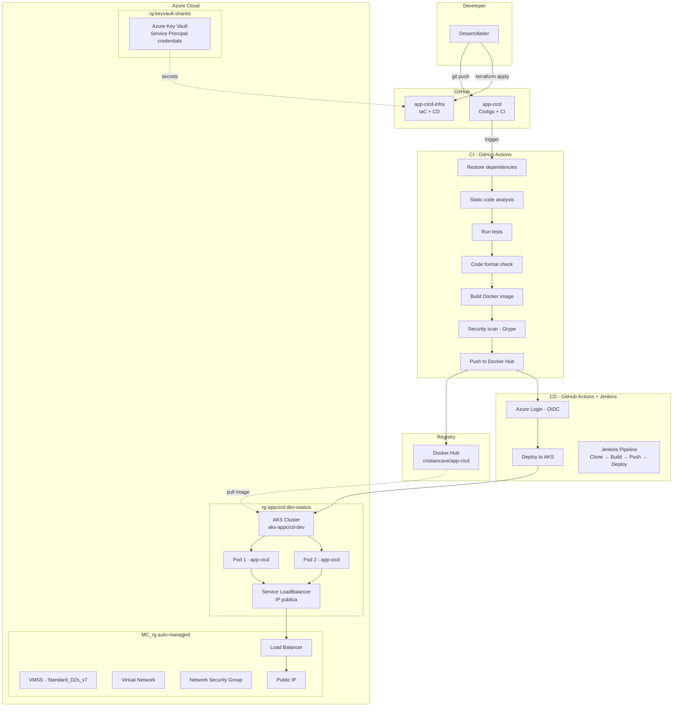

# app-cicd-infra

Repositorio de infraestructura como código (IaC) y pipeline CD para la aplicación [app-cicd](https://github.com/cristiancave/app-cicd). Este repositorio gestiona toda la infraestructura en Azure y el pipeline de entrega continua con Jenkins, siguiendo el patrón enterprise de separación de responsabilidades entre desarrollo e infraestructura.

[](Jenkinsfile)
[](terraform/)
[](k8s/)

## ¿Por qué dos repositorios?

En un entorno enterprise, el código de la aplicación y la infraestructura se separan en repositorios distintos por las siguientes razones:

- **Segregación de responsabilidades:** el equipo de desarrollo trabaja en `app-cicd` (código, pruebas, CI) y el equipo de operaciones/DevOps trabaja en `app-cicd-infra` (infraestructura, despliegue, CD).
- **Control de acceso:** un desarrollador no debería poder modificar la infraestructura de producción, y un ingeniero de infraestructura no necesita acceso al código fuente.
- **Ciclos de vida independientes:** la infraestructura cambia con poca frecuencia, mientras que el código cambia constantemente. Separarlos evita despliegues innecesarios.
- **Auditoría:** los cambios en infraestructura se revisan y aprueban por separado, facilitando el cumplimiento normativo.

## Arquitectura



## Estructura del repositorio

```
app-cicd-infra/
├── terraform/              # Infraestructura como código
│   ├── main.tf             # Provider Azure + recursos (AKS, Resource Group)
│   ├── variables.tf        # Variables configurables (región, tamaño VM, etc.)
│   └── outputs.tf          # Datos de salida (cluster name, kubeconfig)
├── k8s/                    # Manifiestos de Kubernetes
│   ├── deployment.yaml     # Deployment con 2 réplicas, probes y resource limits
│   └── service.yaml        # Service LoadBalancer con IP pública
├── Jenkinsfile             # Pipeline CD con Jenkins
├── .gitignore              # Excluye .terraform/, tfstate, tfvars
└── README.md
```

## Tecnologías y justificación

| Tecnología | Propósito | Justificación DevOps |
|---|---|---|
| **Terraform** | Infraestructura como código | Permite crear, modificar y destruir infraestructura de forma reproducible, versionada y auditada. Agnóstico de nube. |
| **Azure Key Vault** | Gestión de secretos | Almacena las credenciales del Service Principal de forma centralizada y encriptada, eliminando secretos hardcodeados. |
| **Azure AKS** | Orquestación de contenedores | Kubernetes administrado por Azure. Ofrece escalado automático, alta disponibilidad y self-healing de pods. |
| **Jenkins** | Pipeline CD | Herramienta de CI/CD auto-hospedada, extensible con plugins, agnóstica de proveedor de repositorios. Estándar en enterprise. |
| **Docker Hub** | Registro de imágenes | Almacena las imágenes Docker publicadas por el pipeline CI. En producción se usaría Azure Container Registry (ACR) para mayor seguridad y velocidad. |
| **OIDC Federation** | Autenticación sin secretos | GitHub Actions se autentica en Azure sin almacenar contraseñas, usando tokens temporales basados en confianza federada. |

## Terraform — Infraestructura como código

### Recursos creados

Terraform gestiona los siguientes recursos en Azure:

1. **Resource Group** (`rg-appcicd-dev-eastus`) — contenedor lógico para todos los recursos del proyecto.
2. **AKS Cluster** (`aks-appcicd-dev`) — cluster de Kubernetes con 1 nodo `Standard_D2s_v7`, tier Free, identidad administrada `SystemAssigned`.

Adicionalmente, se crearon manualmente (fuera de Terraform) para la gestión de secretos:

3. **Resource Group** (`rg-keyvault-shared`) — separado porque es compartido entre proyectos y ambientes.
4. **Key Vault** (`kv-appcicd-shared`) — almacena `sp-client-id`, `sp-client-secret` y `sp-tenant-id`.

### Naming convention

Todos los recursos siguen la convención `tipo-proyecto-ambiente-región`:

- `rg-appcicd-dev-eastus` → Resource Group, proyecto appcicd, ambiente dev, región eastus
- `aks-appcicd-dev` → AKS Cluster, proyecto appcicd, ambiente dev
- `kv-appcicd-shared` → Key Vault, proyecto appcicd, compartido entre ambientes
- `sp-appcicd-dev` → Service Principal, proyecto appcicd, ambiente dev

### Integración con Key Vault

Terraform lee los secretos del Service Principal directamente desde Azure Key Vault usando `data sources`, eliminando la necesidad de tener credenciales en archivos locales o variables de entorno:

```hcl
data "azurerm_key_vault_secret" "client_id" {
  name         = "sp-client-id"
  key_vault_id = data.azurerm_key_vault.shared.id
}
```

### Comandos de uso

```bash
# Inicializar Terraform (descarga proveedores)
cd terraform/
terraform init

# Ver plan de cambios sin aplicar
terraform plan

# Crear la infraestructura
terraform apply

# Destruir toda la infraestructura (ahorra créditos)
terraform destroy
```

### Gestión de costos

El cluster AKS se puede detener para no generar costos cuando no está en uso:

```bash
# Detener el cluster (deja de cobrar por VMs)
az aks stop --resource-group rg-appcicd-dev-eastus --name aks-appcicd-dev

# Iniciar el cluster
az aks start --resource-group rg-appcicd-dev-eastus --name aks-appcicd-dev
```

## Kubernetes — Manifiestos de despliegue

### deployment.yaml

Define el despliegue de la aplicación con las siguientes características enterprise:

- **2 réplicas** — alta disponibilidad; si un pod falla, el otro sigue atendiendo.
- **Readiness probe** — Kubernetes verifica `/health` cada 10 segundos antes de enviar tráfico al pod.
- **Liveness probe** — Kubernetes verifica `/health` cada 15 segundos; si falla, reinicia el pod automáticamente.
- **Resource requests/limits** — cada pod tiene garantizados 100m CPU y 128Mi RAM, con límite de 250m CPU y 256Mi RAM. Evita que un pod consuma todos los recursos del nodo.

### service.yaml

Expone la aplicación a internet mediante un `LoadBalancer` de Azure:

- Puerto externo: **80** (estándar web)
- Puerto interno: **8080** (donde escucha la app .NET)
- Azure crea automáticamente un Azure Load Balancer con IP pública.

## Jenkins — Pipeline CD

El `Jenkinsfile` define un pipeline declarativo con 4 stages que representan el flujo de entrega continua:

| Stage | Descripción | Comando principal |
|---|---|---|
| **Clone repository** | Descarga el código fuente desde GitHub | `git branch: 'main', url: '...'` |
| **Build Docker image** | Construye la imagen Docker con el código compilado | `docker build -t image:tag .` |
| **Push to Docker Hub** | Publica la imagen en el registro (dos tags: versión + latest) | `docker push image:tag` |
| **Deploy to AKS** | Actualiza el deployment en AKS con la nueva imagen | `kubectl set image deployment/...` |

### ¿Por qué Jenkins además de GitHub Actions?

El proyecto implementa **dos herramientas de CI/CD** por diseño:

- **GitHub Actions** maneja el CI y el CD automatizado. Se integra nativamente con GitHub y usa OIDC para autenticarse en Azure sin secretos almacenados.
- **Jenkins** representa el patrón de CD auto-hospedado, común en empresas que requieren control total sobre su infraestructura de pipelines, independencia de proveedor de repositorios, y personalización avanzada con plugins.

Ambas herramientas coexisten sin conflicto porque operan en fases distintas del ciclo de vida.

## Seguridad

### Service Principal con RBAC

Se creó un Service Principal (`sp-appcicd-dev`) con rol `Contributor` limitado exclusivamente a la suscripción del proyecto. Principio de menor privilegio: puede crear y modificar recursos, pero no puede gestionar accesos de otros usuarios.

### Azure Key Vault

Las credenciales del Service Principal se almacenan encriptadas en Azure Key Vault con acceso controlado por RBAC (`Key Vault Secrets Officer`). Nunca se almacenan en código, archivos de configuración ni variables de entorno persistentes.

### OIDC Federation (Credenciales federadas)

GitHub Actions se autentica en Azure mediante OIDC (OpenID Connect), eliminando la necesidad de almacenar el `clientSecret` en GitHub:

1. GitHub genera un token temporal que identifica el repositorio y la rama.
2. Azure verifica el token contra la credencial federada configurada.
3. Azure otorga acceso temporal (minutos) al Service Principal.
4. No hay contraseñas almacenadas que puedan filtrarse o expirar.

La credencial federada está configurada exclusivamente para `repo:cristiancave/app-cicd:ref:refs/heads/main`, lo que significa que solo la rama `main` de ese repositorio específico puede autenticarse.

### Nota sobre Trivy

Inicialmente se consideró Trivy (Aqua Security) para escaneo de vulnerabilidades de imágenes Docker. Sin embargo, en marzo de 2026 Trivy sufrió un ataque a la cadena de suministro (CVE-2026-33634) que comprometió GitHub Actions, binarios y Docker Hub images, inyectando malware que exfiltraba credenciales de CI/CD. Se optó por **Grype** (Anchore) como alternativa segura para el escaneo de imágenes en el pipeline CI.

## Repositorio relacionado

| Repositorio | Responsabilidad |
|---|---|
| [app-cicd](https://github.com/cristiancave/app-cicd) | Código fuente de la aplicación .NET, Dockerfile, pipeline CI (GitHub Actions), pipeline CD automatizado a AKS |
| [app-cicd-infra](https://github.com/cristiancave/app-cicd-infra) | Infraestructura como código (Terraform), manifiestos de Kubernetes, pipeline CD (Jenkins) |

## Prerequisitos

- [Terraform](https://developer.hashicorp.com/terraform/install) >= 1.0
- [Azure CLI](https://learn.microsoft.com/en-us/cli/azure/install-azure-cli) >= 2.50
- [kubectl](https://kubernetes.io/docs/tasks/tools/) >= 1.28
- [Docker Desktop](https://www.docker.com/products/docker-desktop/) (para Jenkins local)
- Cuenta de Azure con suscripción activa