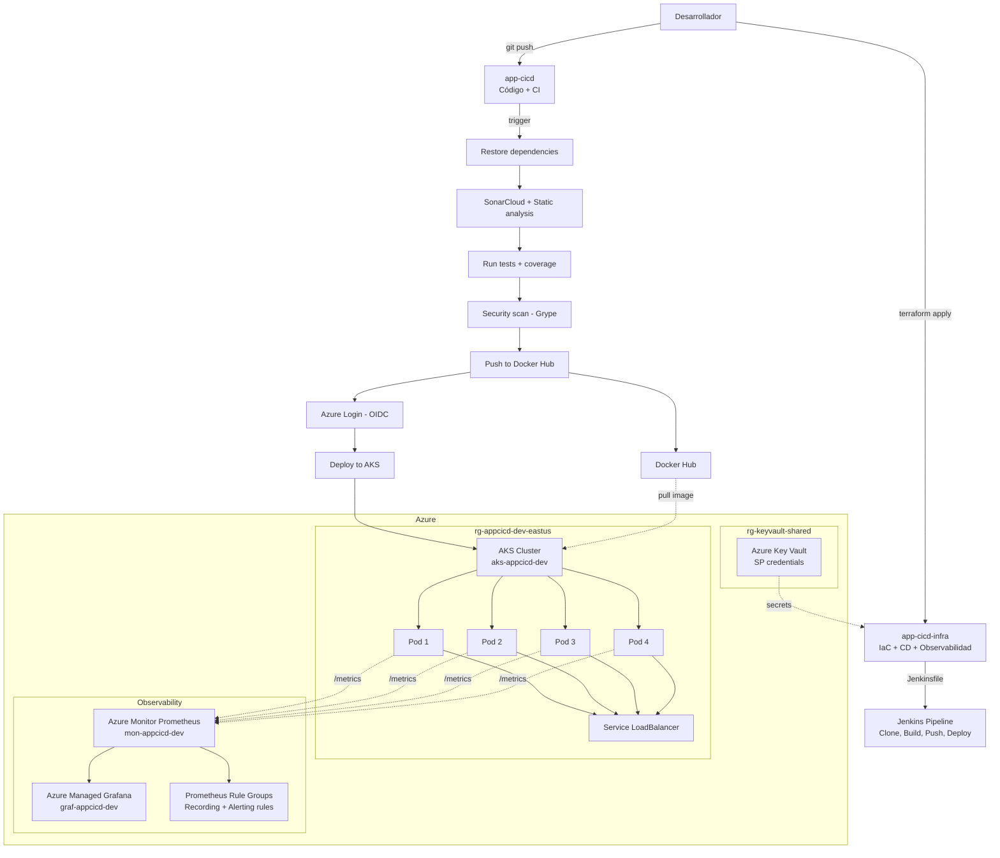

# app-cicd-infra

Repositorio de infraestructura como código (IaC) y observabilidad para la aplicación [app-cicd](https://github.com/cristiancave/app-cicd). Gestiona toda la infraestructura en Azure, el pipeline CD con Jenkins, los SLOs de la aplicación y los dashboards de monitoreo, siguiendo el patrón enterprise de separación de responsabilidades entre desarrollo e infraestructura.

[](Jenkinsfile)
[](terraform/)
[](k8s/)

## ¿Por qué dos repositorios?

En un entorno enterprise, el código de la aplicación y la infraestructura se separan en repositorios distintos:

- **Segregación de responsabilidades:** el equipo de desarrollo trabaja en `app-cicd` (código, pruebas, CI) y el equipo de operaciones/DevOps trabaja en `app-cicd-infra` (infraestructura, despliegue, CD, observabilidad).
- **Control de acceso:** un desarrollador no debería poder modificar la infraestructura de producción.
- **Ciclos de vida independientes:** la infraestructura cambia con poca frecuencia, mientras que el código cambia constantemente.
- **Auditoría:** los cambios en infraestructura se revisan y aprueban por separado.

## Arquitectura



## Estructura del repositorio

```
app-cicd-infra/
├── terraform/                         # Infraestructura como código
│   ├── main.tf                        # Provider Azure + recursos (AKS, Resource Group)
│   ├── variables.tf                   # Variables configurables
│   └── outputs.tf                     # Datos de salida (cluster name, kubeconfig)
├── k8s/                               # Manifiestos de Kubernetes
│   ├── deployment.yaml                # Deployment con 4 réplicas, probes, resource limits
│   ├── service.yaml                   # Service LoadBalancer con IP pública
│   └── observability/                 # Configuración de observabilidad
│       ├── namespace.yaml             # Namespace monitoring
│       └── podmonitor.yaml            # PodMonitor para scraping de /metrics
├── bicep/                             # IaC Azure nativa
│   └── prometheus-rules.bicep         # Recording rules (SLI) + Alerting rules (SLO)
├── grafana/                           # Dashboards
│   └── app-cicd-slo-dashboard.json    # Dashboard SLO con 7 paneles
├── Jenkinsfile                        # Pipeline CD con Jenkins
├── .gitignore                         # Excluye .terraform/, tfstate, tfvars
└── README.md
```

## Tecnologías y justificación

| Tecnología | Propósito | Justificación DevOps |
|---|---|---|
| **Terraform** | Infraestructura como código | Crea, modifica y destruye infraestructura de forma reproducible y versionada. Agnóstico de nube. |
| **Bicep** | IaC Azure nativa | Define Prometheus Rule Groups en formato nativo de Azure (Terraform no soporta este CRD). |
| **Azure Key Vault** | Gestión de secretos | Almacena credenciales del Service Principal encriptadas con RBAC. |
| **Azure AKS** | Orquestación de contenedores | Kubernetes administrado con escalado, alta disponibilidad y self-healing. |
| **Azure Monitor Prometheus** | Recolección de métricas | Prometheus managed por Azure, sin infraestructura adicional. Scraping automático via PodMonitor. |
| **Azure Managed Grafana** | Dashboards de monitoreo | Dashboards SLO con visualización de disponibilidad, error rate y latencia p95. |
| **Jenkins** | Pipeline CD | Auto-hospedado, independiente de proveedor. Estándar en enterprise. |
| **Docker Hub** | Registro de imágenes | Almacena imágenes Docker. En producción se usaría ACR. |
| **OIDC Federation** | Autenticación sin secretos | GitHub Actions se autentica en Azure con tokens temporales. |

## Terraform — Infraestructura como código

### Recursos creados

1. **Resource Group** (`rg-appcicd-dev-eastus`) — contenedor lógico para los recursos.
2. **AKS Cluster** (`aks-appcicd-dev`) — cluster Kubernetes con 3 nodos `Standard_D2ls_v7`, tier Free, identidad `SystemAssigned`.

Creados manualmente:
3. **Resource Group** (`rg-keyvault-shared`) — separado porque es compartido entre proyectos.
4. **Key Vault** (`kv-appcicd-shared`) — almacena `sp-client-id`, `sp-client-secret`, `sp-tenant-id`.

### Naming convention

| Recurso | Nombre | Patrón |
|---|---|---|
| Resource Group | `rg-appcicd-dev-eastus` | tipo-proyecto-ambiente-región |
| AKS Cluster | `aks-appcicd-dev` | tipo-proyecto-ambiente |
| Key Vault | `kv-appcicd-shared` | tipo-proyecto-scope |
| Service Principal | `sp-appcicd-dev` | tipo-proyecto-ambiente |
| Monitor Workspace | `mon-appcicd-dev` | tipo-proyecto-ambiente |
| Grafana | `graf-appcicd-dev` | tipo-proyecto-ambiente |

### Integración con Key Vault

Terraform lee secretos desde Azure Key Vault usando data sources:

```hcl
data "azurerm_key_vault_secret" "client_id" {
  name         = "sp-client-id"
  key_vault_id = data.azurerm_key_vault.shared.id
}
```

### Comandos de uso

```bash
cd terraform/
terraform init        # Descarga proveedores
terraform plan        # Vista previa de cambios
terraform apply       # Crear infraestructura
terraform destroy     # Destruir todo (ahorra créditos)
```

### Gestión de costos

```bash
# Detener cluster (deja de cobrar por VMs)
az aks stop --resource-group rg-appcicd-dev-eastus --name aks-appcicd-dev

# Iniciar cluster
az aks start --resource-group rg-appcicd-dev-eastus --name aks-appcicd-dev
```

## Kubernetes — Manifiestos de despliegue

### deployment.yaml

- **4 réplicas** — alta disponibilidad y distribución de carga entre nodos.
- **Readiness probe** — verifica `/health` cada 10s antes de enviar tráfico.
- **Liveness probe** — verifica `/health` cada 15s; si falla, reinicia el pod.
- **Resource requests/limits** — CPU y memoria garantizados y limitados.
- **Puerto nombrado `http`** — requerido por el PodMonitor para scraping de métricas Prometheus.

### service.yaml

Expone la aplicación a internet mediante `LoadBalancer` de Azure:
- Puerto externo: **80** (estándar web)
- Puerto interno: **8080** (donde escucha la app .NET)

## Observabilidad y SLOs

### Arquitectura de observabilidad

```
App .NET (4 pods) → expone /metrics
    ↓
PodMonitor (scrape cada 30s)
    ↓
Azure Monitor managed Prometheus (mon-appcicd-dev)
    ↓
Prometheus Rule Groups (definidos en Bicep)
    ├── 4 Recording rules (precálculos SLI)
    └── 3 Alerting rules (disparan cuando se violan SLOs)
    ↓
Azure Managed Grafana (graf-appcicd-dev)
    └── Dashboard SLO con 7 paneles visuales
```

### SLOs definidos

| SLO | Objetivo | Métrica base |
|---|---|---|
| **Disponibilidad** | ≥ 99.5% | Tasa de respuestas 2xx sobre total de peticiones |
| **Error rate** | ≤ 0.5% | Tasa de respuestas 5xx sobre total de peticiones |
| **Latencia p95** | ≤ 500ms | Percentil 95 de duración de peticiones HTTP |

### Componentes implementados

**k8s/observability/namespace.yaml:**
Crea el namespace `monitoring` donde vive el PodMonitor.

**k8s/observability/podmonitor.yaml:**
Le dice a Azure Monitor Prometheus que scrapee el endpoint `/metrics` de los pods con label `app: app-cicd` cada 30 segundos.

**bicep/prometheus-rules.bicep:**
Define en formato Azure nativo (porque Azure managed no soporta el CRD `PrometheusRule` de Kubernetes):
- **4 Recording rules:** precalculan los SLIs (tasa de peticiones, tasa de errores, latencia p95, tasa de disponibilidad) para consultas eficientes.
- **3 Alerting rules:** disparan cuando un SLO se viola (disponibilidad < 99.5%, error rate > 0.5%, latencia p95 > 500ms).

Para aplicar las reglas:
```bash
az deployment group create \
  --resource-group rg-appcicd-dev-eastus \
  --template-file bicep/prometheus-rules.bicep
```

**grafana/app-cicd-slo-dashboard.json:**
Dashboard con 7 paneles para importar en Azure Managed Grafana:
- Disponibilidad actual (gauge)
- Error rate actual (gauge)
- Latencia p95 actual (gauge)
- Request rate por código HTTP (time series)
- Error rate histórico (time series)
- Latencia por percentil (time series)
- Estado de SLOs (table)

Para importar: Grafana → Dashboards → New → Import → subir el JSON.

### Verificación

```bash
# Ver estado del PodMonitor
kubectl get podmonitors -n monitoring

# Ver Prometheus Rule Groups en Azure
az resource list --resource-type Microsoft.AlertsManagement/prometheusRuleGroups

# Ver métricas en vivo (Grafana → Explore)
# Datasource: Managed_Prometheus_mon-appcicd-dev
# Query: http_requests_received_total{job="app-cicd"}

# Verificar que /metrics responde
curl http://<EXTERNAL-IP>/metrics
```

## Jenkins — Pipeline CD

El `Jenkinsfile` define un pipeline declarativo con 4 stages:

| Stage | Descripción | Comando principal |
|---|---|---|
| **Clone repository** | Descarga el código fuente desde GitHub | `git branch: 'main', url: '...'` |
| **Build Docker image** | Construye la imagen Docker | `docker build -t image:tag .` |
| **Push to Docker Hub** | Publica la imagen (versión + latest) | `docker push image:tag` |
| **Deploy to AKS** | Actualiza el deployment en AKS | `kubectl set image deployment/...` |

### ¿Por qué Jenkins además de GitHub Actions?

- **GitHub Actions** maneja CI y CD automatizado. Se integra con GitHub y usa OIDC para autenticarse en Azure sin secretos.
- **Jenkins** representa el patrón de CD auto-hospedado, común en empresas que requieren control total e independencia de proveedor.

## Seguridad

### Service Principal con RBAC
`sp-appcicd-dev` con rol `Contributor` limitado a la suscripción. Puede crear y modificar recursos, pero no gestionar accesos.

### Azure Key Vault
Credenciales encriptadas con acceso controlado por RBAC (`Key Vault Secrets Officer`). Nunca en código ni variables de entorno.

### OIDC Federation
GitHub Actions se autentica con tokens temporales. Configurado exclusivamente para `repo:cristiancave/app-cicd:ref:refs/heads/main`.

### Nota sobre Trivy
Descartado tras el ataque de cadena de suministro de marzo 2026 (CVE-2026-33634). Se usa **Grype** (Anchore) como alternativa segura.

## Repositorio relacionado

| Repositorio | Responsabilidad |
|---|---|
| [app-cicd](https://github.com/cristiancave/app-cicd) | Código fuente, Dockerfile, CI/CD (GitHub Actions), métricas Prometheus |
| [app-cicd-infra](https://github.com/cristiancave/app-cicd-infra) | Terraform, K8s manifests, Bicep (SLO rules), Grafana dashboard, Jenkins |

## Prerequisitos

- [Terraform](https://developer.hashicorp.com/terraform/install) >= 1.0
- [Azure CLI](https://learn.microsoft.com/en-us/cli/azure/install-azure-cli) >= 2.50
- [kubectl](https://kubernetes.io/docs/tasks/tools/) >= 1.28
- [Docker Desktop](https://www.docker.com/products/docker-desktop/) (para Jenkins local)
- Cuenta de Azure con suscripción activa